# [실습] 로그인 경보 자동화 봇 — 제출문
- 이름: 강아름
- 사용한 n8n 버전: 2.37.10 / Code 노드 언어: Python
- 메신저 3종 중 실제로 연결한 것: 슬랙, 텔레그램, 디스코드

## 실행 순서 (4줄)
① 켜는 것: Docker 컨테이너(MySQL, n8n, 웹훅 서버) 및 n8n 워크플로우 활성화(Active)
② 실행하는 것: 트래픽 생성/테스트 웹훅 요청 발송 (curl 또는 과제 테스트 스크립트 실행)
③ 통과 화면: 메신저 3곳(슬랙·디스코드·텔레그램) 수신 + MySQL security_events 테이블 내 본인 이름의 allow/deny 로그 조회
④ 안 될 때 보는 곳: n8n 좌측 Executions(실행 이력/에러 노드) 및 터미널의 docker logs 

## 체크리스트 결과
(문제지 4번 체크리스트를 [x]/[ ] 로 채워 붙여넣기 + 항목별 증적 파일명)

## 증적 목록
### A. 파이썬 전송기
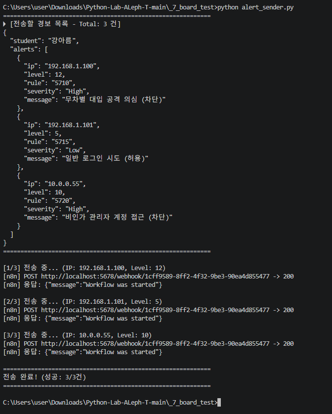

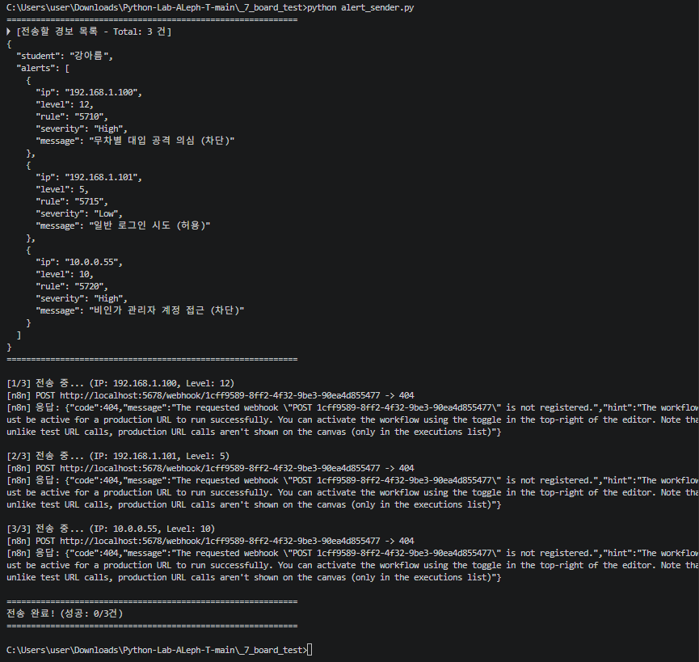

### B. n8n 판정
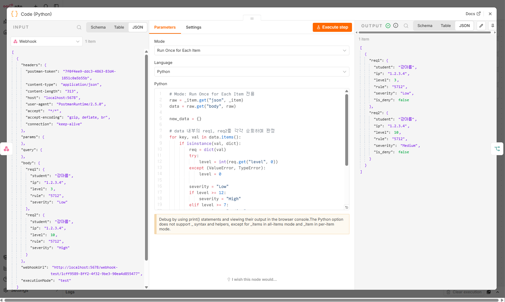

ALERTS_DATA = [
    {
        "ip": "192.168.1.100",
        "level": 12,       # 레벨 10 이상 -> 거부(deny) 대상
        "rule": "5710",
        "severity": "High",
        "message": "무차별 대입 공격 의심 (차단)"
    },
    {
        "ip": "192.168.1.101",
        "level": 5,        # 레벨 10 미만 -> 허용(allow) 대상
        "rule": "5715",
        "severity": "Low",
        "message": "일반 로그인 시도 (허용)"
    },
    {
        "ip": "10.0.0.55",
        "level": 10,       # 레벨 10 이상 -> 거부(deny) 대상
        "rule": "5720",
        "severity": "High",
        "message": "비인가 관리자 계정 접근 (차단)"
    }
]

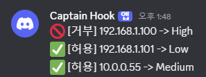

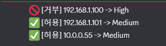

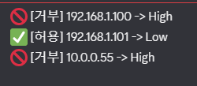

B4 n8n Code 노드 언어 함정 및 해결

1. 문제 원인
실행 모드 불일치: Run Once for Each Item 모드에서 전체 참조 변수(_input, items)를 호출하여 NameError 발생.

보안 샌드박스 제약: n8n Python 러너의 보안 격리 정책으로 일부 내장 함수(globals() 등) 차단.

런타임 의존성: Node.js 기반인 n8n 특성상 Python 환경 구성 및 호환성 문제 발생.

2. 해결 방안
단기 조치: Code 노드 모드와 변수 일치 (Each Item 모드는 _item, All Items 모드는 _input.all() 사용).

근본 조치: 수신 스크립트(alert_sender.py)만 Python으로 작성하고, n8n 내부 처리는 네이티브 언어인 JavaScript로 전환하여 런타임 오류 차단.

### C. 분기와 메신저

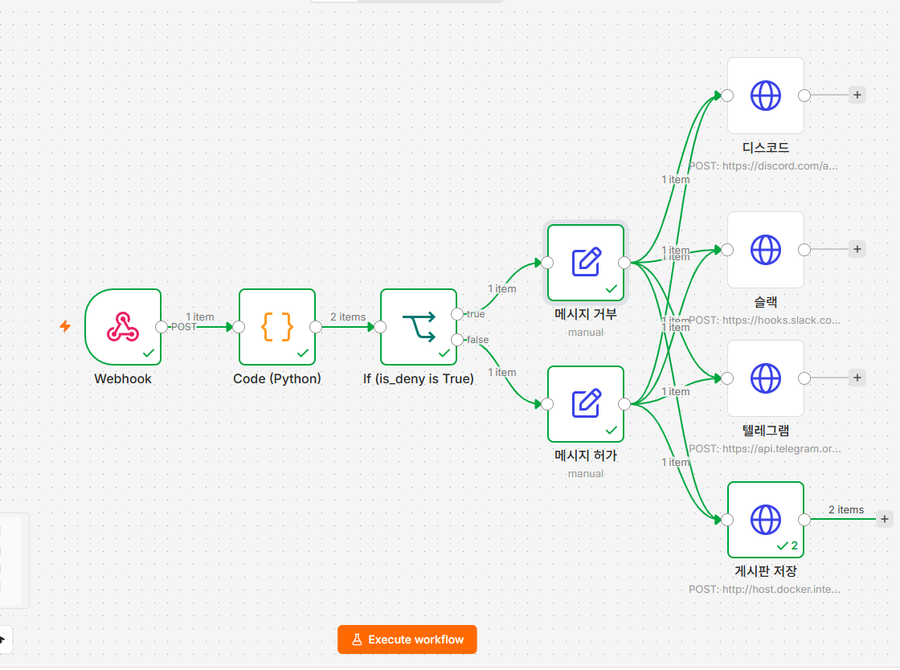

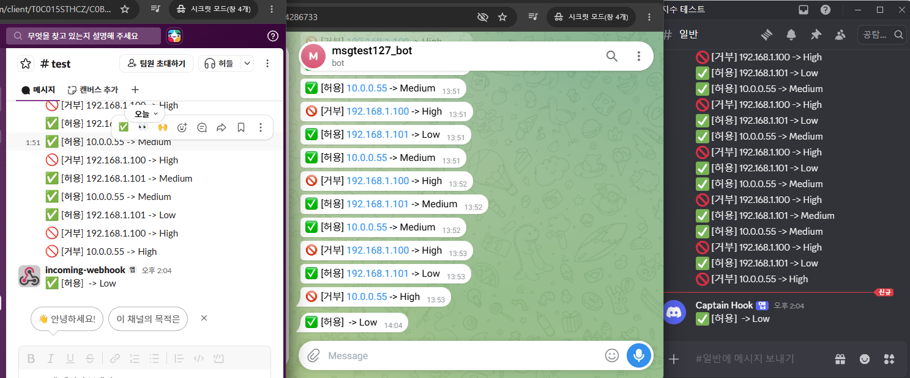

### D. 게시판 REST + DB

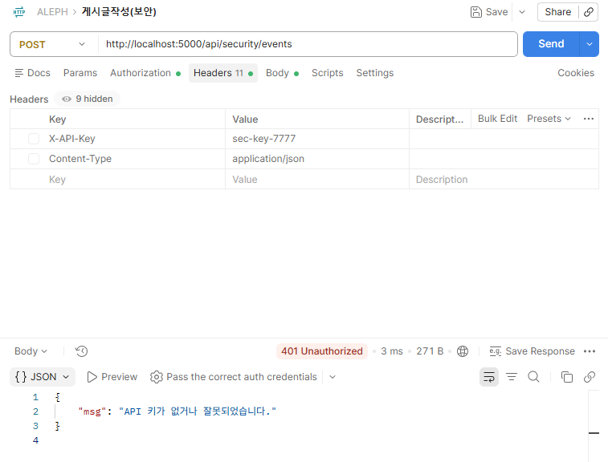

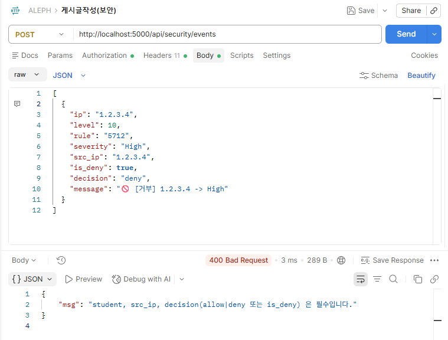

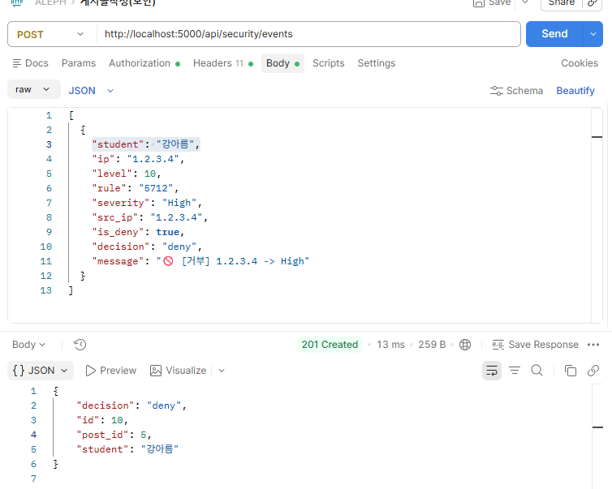

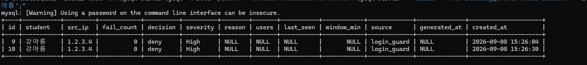

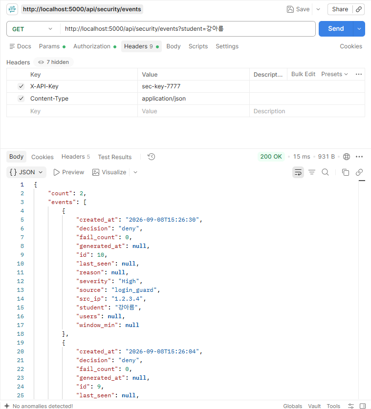

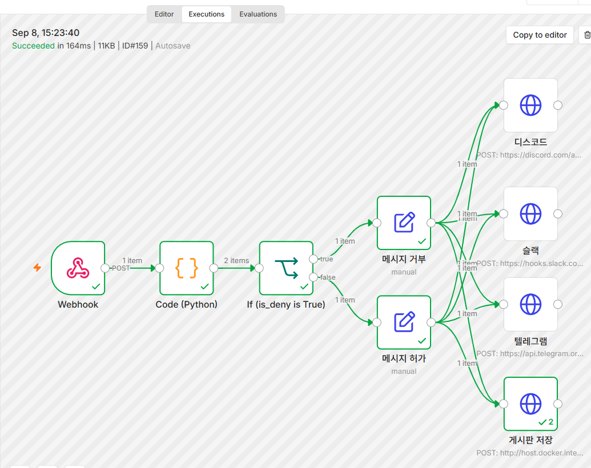

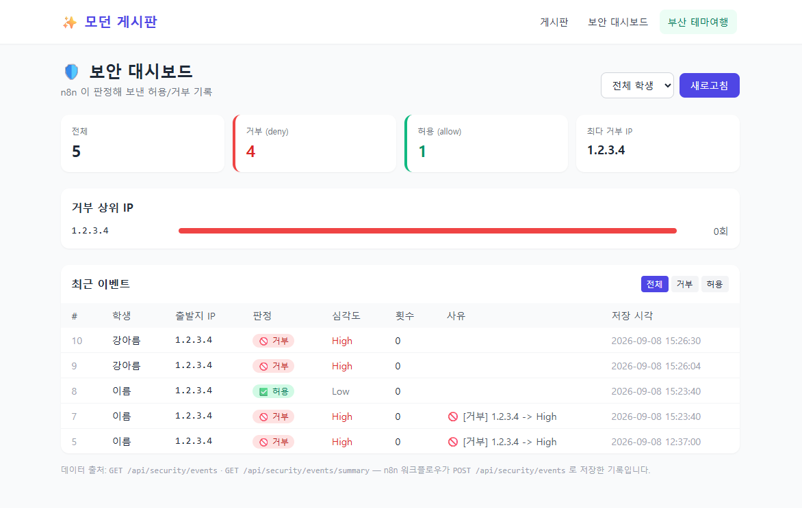

## AI 활용 구분
- AI 에게 맡긴 일: 파이썬 파싱 및 판정 코드 작성, MySQL 쿼리 및 터미널 인코딩 오류 해결 명령어 생성
- 내가 직접 판단한 일: 메시지 가공 위치(파이썬 제외, n8n 노드 위임) 및 과제 규격(IF 분기 필수, 원본 필드 보존) 확정
- AI 제안을 따르지 않은 일(또는 없었던 이유): 파이썬 단독 API/메시지 발송 및 하드코딩 제안을 거절하고, 과제 채점 기준에 맞춰 n8n 정석 노드 구조 유지 판단

## 막혔던 것 · 해결 (1~3개)
- 파이썬 샌드박스 변수 인식 오류: _input.all() 및 표준 라이브러리(sys, dir) 호출 차단 에러 발생 → All Items 모드의 주입 변수인 _items를 찾아내어 Split Out 없이 파이썬 단독으로 낱개 아이템 분리 반환 성공

- MySQL 터미널 한글 깨짐: Windows PowerShell 환경에서 UTF-8 인코딩 불일치로 한글 데이터가 깨져 출력됨 → chcp 65001 적용 및 쿼리 시 --default-character-set=utf8mb4 옵션 부여로 해결